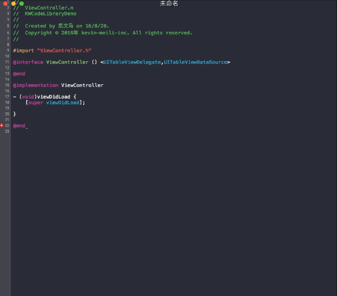

# KWCodeLibrary

* [English](#english)
* [中文简体](#chinese)

<h1 id="english">English</h1>

KWCodeLibrary is a plug-in for Xcode to help you to manager your code snippet instean of xcode code snippet.

## What can it do ?

	- add the code snippet you used usually to Code Library.
	- improve coding speed
	- easy to copy your code snippet to another Xcode.
	- import from your Xcode code snippet.
	- support turn on and turn off.

## Install

	- search "KWCodeLibrary" in alcatraz(Package Manager),and install.
	- "curl -fsSL https://raw.githubusercontent.com/kevin-ma/KWCodeLibrary/master/Install/install.sh | sh".
	- [downloadZip](https://github.com/kevin-ma/KWCodeLibrary/releases/download/v1.0/KWCodeLibrary.tar.gz) and copy to plugin directory.
	- clone this repo,build the project and done.

## Usage

It's very easy to use. you can find setting for `KWCodeLibrary` in *Window*->*KWCodeLibrary*, or you can use *cammand+shift+7* to into Code Library. Add/Delete/Edit as you want to.

Finish that, you can use that in workspace like the demo gif image.

## feedback

@kevin, [devkevinma@gmail.com](mailto://devkevinma@gmail.com)

<h1 id="chinese">Chinese</h1>

KWCodeLibrary 是一款Xcode插件，它能代替 Xcode 自带的 Code Snippet 帮助你管理的代码段。

## 它可以做些什么？
	
	- 将你常用的代码段添加到代码库中。
	- 提高编码速度。
	- 轻松导出一个 Xcode 中的代码段到其他 Xcode。
	- 从 Xcode 自带的 Code Snippet 导入。
	- 快速开启和关闭。
	- 。。。

## 安装

	- 在 alcatraz(Package Manager) 中搜索 KWCodeLibrary。
	- 执行命令 "curl -fsSL https://raw.githubusercontent.com/kevin-ma/KWCodeLibrary/master/Install/install.sh | sh"。
	- [下载安装包](https://github.com/kevin-ma/KWCodeLibrary/releases/download/v1.0/KWCodeLibrary.tar.gz)并拷贝到插件安装目录。
	- 下载代码，然后运行。

## 使用

它非常容易使用，在 Xcode 菜单中的 *Window* 下有一个 *KWCodeLibrary* 菜单，关于这个插件的功能都在这里，当然你也可以使用快捷键 *cammand+shift+7* 打开代码库，快捷键 *cammand+shift+8* 开启/关闭插件功能。

按照自己的习惯添加、修改相关代码段后，就可以在代码编辑区一展风采了，就像上面 gif 图片中那样。

## 反馈

@kevin, [devkevinma@gmail.com](mailto://devkevinma@gmail.com)
